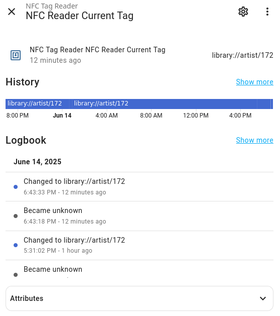

# Home Assistant NFC Reader

Like [adonno's](https://github.com/adonno/tagreader) tagreader component, but with a USB NFC reader that you can plug into a PC or Raspberry Pi.

You can use it to build a similar [NFC Jukebox with Home Assistant](https://www.home-assistant.io/integrations/tag/) but without having to solder or 3D print anything 😁.

## Background

I created an NFC Jukebox with Home Assistant using [adonno's](https://github.com/adonno/tagreader) tagreader component, but unfortunately it broke 😢.
When I tried to purchase a replacement, I found that lead times were around 1 month and my wife (who had gotten to really like the jukebox) did not want to wait that long.

So I decided to see if I can use a USB NFC reader (that Amazon could ship me in like 4 hours) instead.
Turns out getting the code working took a lot longer than that (due to a bug in libNFC, among other things), but I figured I may as well share it in case it's useful to anyone else.

## Requirements

I've tested this with

- This particular [ACR122U NFC reader](https://www.amazon.com/dp/B07DK9GX1N)
- These specific [NTAG215 NFC tags](https://www.amazon.com/dp/B0CHVWTRGC).

It might work with other NFC readers/tags, but I have no plans on using anything else.

## Installation

This requires PC/SC to be installed on the host system. I tried putting it in the Docker container, but after a lot of lost time I just couldn't get it to work without at least having it _installed_ on the host system. At that point there's no benefit to running another version in the container.

### PC/SC

On Raspberry Pi, you can install PC/SC with the following command:

```bash
sudo apt-get install pcscd pcsc-tools
```

On [Arch Linux](https://wiki.archlinux.org/title/NFC), you can install PC/SC with the following command:

```bash
sudo pacman -S pcsclite pcsc-tools
```

Then you need to start the PC/SC daemon:

```bash
sudo systemctl enable --now pcscd
```

You can verify that the PC/SC daemon is running with the following command:

```bash
pscs_scan
```

You should see your NFC reader listed, and when you tap an NFC tag, it should show up in the output.
If this does not happen, `homeassistant-usb-tagreader` will not work so you need to troubleshoot your PC/SC installation.

### Home Assistant

You need to have the MQTT integration enabled and configured in Home Assistant. The [official documentation](https://www.home-assistant.io/integrations/mqtt/) describes that in detail, but you can also try clicking this giant button:

[](https://my.home-assistant.io/redirect/config_flow_start?domain=mqtt)

### Docker

Finally, you need to run the Docker container with access to the host's PC/SC socket.
An example [docker-compose.yml](./docker-compose.yml) file is included in this repository. Here it is for reference:

```yaml
services:
  nfc-reader:
    image: ghcr.io/shocklateboy92/homeassistant-usb-tagreader:main
    container_name: nfc-reader
    volumes:
      - /run/pcscd:/run/pcscd # Mount PCSC socket from host
    restart: unless-stopped
    environment:
      - LOG_LEVEL=INFO # Set log level (DEBUG, INFO, WARNING, ERROR, CRITICAL)
      # MQTT configuration
      - MQTT_BROKER=your-mqtt-broker
      - MQTT_USERNAME=your-username
      - MQTT_PASSWORD=your-password
```

`your-mqtt-broker` is usually your home assistant instance, which is typically `homeassistant.local`. If you use a non-standard port, you can specify an `MQTT_PORT` environment variable as well. You can see the full list of environment variables in the top of [mqtt_handler.py](./mqtt_handler.py).

`your-username` and `your-password` are the credentials you use to connect to your MQTT broker. If you clicked the giant button above and had the Home Assistant MQTT integration install and configure the MQTT Add-on for you, the usernames and passwords that you use to log into Home Assistant will also work for the MQTT broker.

You can use your regular user if you'd like, but [their documentation](https://github.com/home-assistant/addons/blob/5c01a323ba84e6aa534302ace0b7539d3582e65d/mosquitto/DOCS.md#how-to-use) recommends creating a dedicated user for MQTT.

## Usage

Since this uses MQTT, it can't fire the `tag_scanned` event like adonno's tagreader component does.

Instead, it creates a sensor that contains the Tag ID of the currently present NFC tag.<br>
I.e. if there's a tag on top of the NFC reader right now the sensor state will be ID of that tag, and once you remove the tag the sensor state will be `unknown`.



You can use this sensor in automation triggers to play the approriate music then its state changes.

# Support

I don't think I'll have much time to investigate issues or add new features, but I will try to at least take a look at pull requests if you've figured out how to fix something.

Create the PR of the earliest rough draft that you can, so I can give feedback on whether I like your approach before you spend a significant amount of time on it.

## AI Use disclosure

Claude Sonnet 4 wrote a significant portion of this code. I did read its output and guide it to bring the code up to my standards. However, if you have any philosophical objections to AI-generated code, you don't have to use this project 😉.